# VeGastronomy 

VeGastronomy is a fictional, fully plant based, fine dining restaurant based in Edinburgh, Scotland. The cuisine is based on classical dishes, reinvented with a vegan twist. The restaurant aims to fill the gap in the vegan niche of the Edinburgh catering industry, providing a truly remarkable dining experience while maintaining the restaurants ethics and philosophy of being plant based. 

The title of the restuarant is a combination of Vegan and the word "Gastronomy" which is defined as "the art and knowledge involved in preparing and eating good food". 

This site is designed to attract customers, provide an overview of the restaurants philosophy, cuisine and style, and allow customers to make bookings.

- Include a picture of site that shows it in responsive states and links to deployed code: https://ui.dev/amiresponsive

## Live Site
🚨**Required** 

- Include a link to deployed project (typically a GitHub Page on  github.io)

## Repository 

https://github.com/AlexSmall96/VeGastronomy

## Author 

Alex Small

## Table of Contents
🚀 **merit & beyond**

Generate after readme is complete by copying and pasting your readme from this point & below into this tool:
- [mardown table of contents generator](https://ecotrust-canada.github.io/markdown-toc/)
**NOTE:** It does have some bugs if you have dashes or trailing spaces in your headers

# UX
🚀 **merit & beyond** 
## Target Audience
🚀 **merit & beyond**

Although the idea behind this restaurant was to fill a gap in Edinburgh's vegan catering industry, and provide vegans with the oppurtunity to experience fine dining cuisine, the resturant is targeted towards everyone. It aims to showcase that you can still eat delicious food and be vegan. 


## Project Goals
🚀 **merit & beyond**

This site is intended to give the public a concise yet alluring overview of the restaurant, to attract new customers. The site is intendted to be intuitive and easy to follow, with lots of well positioned naviation links. The home page is designed to catch the users attention with the two images, and provide a succinct description of the restaurant. The menu page aims to provide a sample of what the dining experience is like at the restaurant, while the bookings page is designed to allow customers to easily request a table at the restaurant. The footer aims to allow users to easily get in contact with the restaurant, or find out more information on social media.

## User Stories
🚀 **merit & beyond**
### Site User
🚀 **merit & beyond**
As a site user I want to:
 
- Understand what the business is
- Understand the restaurants philosophy and style
- Easily navigate through different sections of the site
- Learn more about what kind of food the restaurant offers
- Easily book a table to visit the restaurant
- View the restaurants social media links for more information or to contact the restaurant

### Website Owner
🚀 **merit & beyond**
As a site owner I want to:
 
- Present the restaurant in a way that attracts most customers
- Present my ideas and philosophy behind the restaurant concisely and clearly
- Provide an overview of the food the restaurant offers

## Design Choices
🚀 **merit & beyond**
The look of the site aims to be similar in style to other traditional fine dining restaurants. This drove me to use a clean background, with professional looking text. Some of the choice of style has a more modern feel to it, such as the footer icons, or the choice of font/letter spacing. This reflects the fact that vegan dining is a relatively modern trend.

### Colors
🚀 **merit & beyond**
The white background of the main body aims to provide a stylish classical, look. This also ties into the aim of giving it a traditional fine dining feel. The grey in the margins was chosen so it would contrast with the main white section. The blue in the footer was used to give it a modern twist.
- include a screenshot of your pallet using a tool like
 
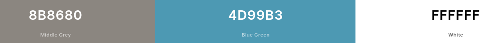

### Typography
🚀 **merit & beyond**
The font used on the site is [Oxygen](https://fonts.google.com/specimen/Oxygen?query=oxygen) from google fonts. I thought this font looked professional yet relaxed.
 
The main heading is the largest font size, to capture the users attention when they first enter the site. The headers of each section are slightly smaller in font size and with a letter spacing. Again, I felt like this added to the relaxed yet professional feel. The headers of subsections, for example in the about section and the links to other pages, are smaller than the header sections and don't have letter spacing, but are still in bold. This helps the user to understand what pieces of text go together.
- include screenshots of fonts used


### Imagery
🚀 **merit & beyond**
The images on the home page were chosen as they appear to be plant based dishes, and are beautifully presented, providing a good first impression of the restaurant's food. The three images on the menu page are designed to give a feel of the range of dishes the restaurant offers, with a main course dish, a dessert dish and raw ingredients being presented. The bookings page features an image of the restaurant. This was chosen as a user who visits the booking page is likely already convinced that they like the food, and the image of the restaurant allows them to imagine further what the experience of dining there would be like, enticing them to fill out the booking form.

## Site Structure and Features
🚀 **merit & beyond**
The site is broken down into three main pages : Home, Menu and Bookings. There is an extra page that is accessed once the bookings form is filled in. Each page has :
 
- A header conisiting of the name of the restaurant and the navigation menu.
- A footer containing social media links.
 
The home page begins with the hero image and cover text, followed by an about section with text and an additional image of a dish. There are then links to the menu and bookings page, before a section containing the opening hours.
 
The menu page contains three dishes, and a full menu, with dishes described in detail. At the bottom of the menu is a link to the home page.
 
The bookings page features a picture of the restaurant, with a form to request a table underneath. If all the fields are completed, the 'request table' button links to the extra page 'form-response.html'. This contains the same image as the bookings page and features a thank you message along with a link to the home page.

The site contains media queries to resize hero, about and bookings images at a certain screen width. This helps to improve the flow of the website at smaller screen sizes.

Don't forget your 404 error page.

## Future Features
🚀 **merit & beyond**

An additional feature that could be added to the site is the inclusion of more menus. This might look like the menu page having links to a tasting menu, a la carte menu, or drinks menu that open as a pdf on a seperate page.

The booking system could also be made more sophisticated, with the times the user can select being restricted to opening hours. 

## Testing
### Resizing Browser ###

Once I was happy with the overall layout and style of the project, I began testing. Firstly, I checked all pages at different browser sizes in dev tools to ensure they maintained their structural integrity and looked visually appealing.
The menu and bookings pages looked good but there were issues with the home page.
 
The first issue I noticed was at Mobile S - 320px, the Menu and Reservations links wouldn't fit on the same line. This looked unprofessional as the boxes weren't lined up.
 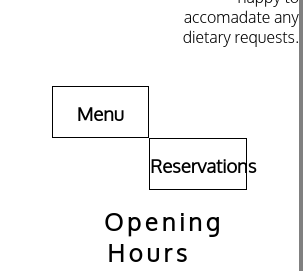
  I adjusted the width of the boxes to 40% which created space for them to be on the same line. I also changed 'Reservations' to 'Bookings' so it would fit in a smaller space. With this issue fixed, the home page looked good at this browser size.

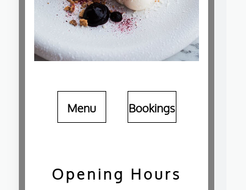

The home page maintained its structure at all other browser sizes except 4K - 2560px. At this size, the about secion was wider than the hero image. 

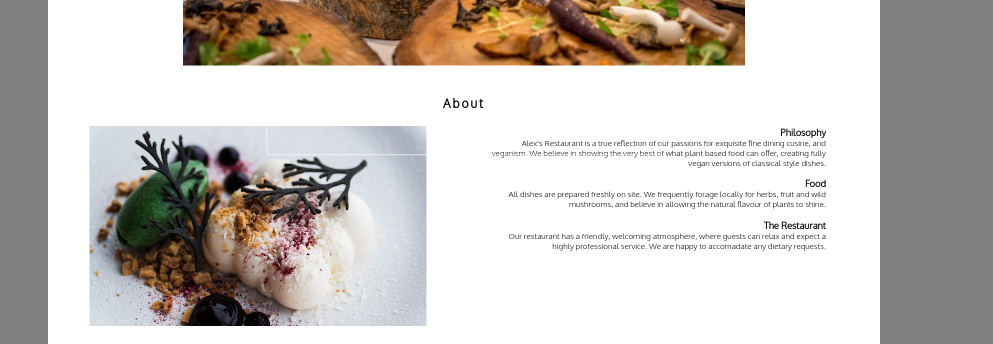

I added max-width: 1124px to the style of the about section and it solved the issue. I also noticed the cover text box had fallen below the hero image. This required me to change position: absolute to position : relative and remove the transform style.

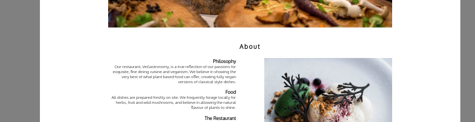

The menu page looked good at all browser sizes, but some of the menu items were too squashed and some lines had only one word.
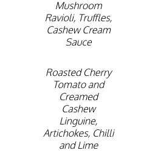

 I added a minimum width to the menu section to allow more space for the items at smaller browser sizes.

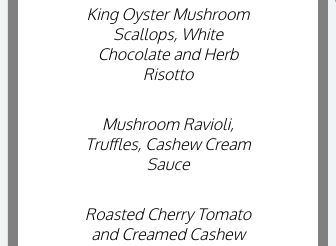

### Integrity of Images and Text ###
Although the above issues were the main problems when resizing the browser, I noticed the hero, about and bookings images weren't as clear at smaller browser sizes. On the home page, the hero image only showed a small slice on a Mobile S - 320px browser. 

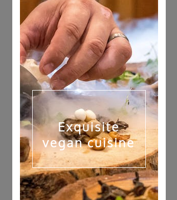

To solve this issue, I introduced a media query, where at 1170px wide and below, the code implements  background-size: 100% auto along with other style changes. 

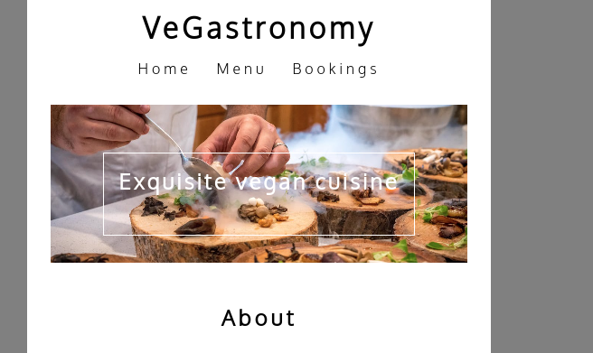

The same issue occured for the bookings image, and again I used a media query to implement a similar style change at 800px. 

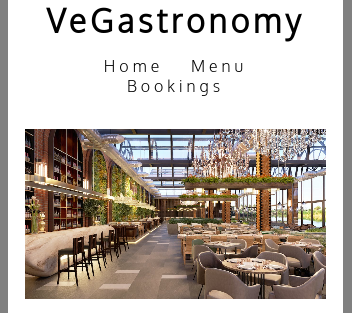

The about section also had a similar problem when resizing the browser window, but this was also affected by the text. 
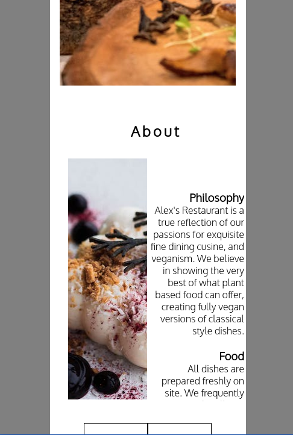

To solve this, I introduced a media query that placed the image below the text at 1170px wide and below. At this point, the text font size and the height of the section change. The result is much more visually pleasing and the layout flows alot better.

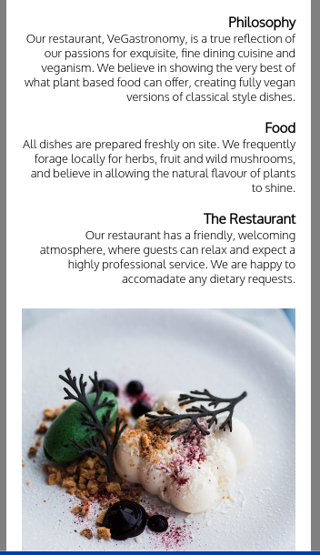
 
### Form Functionality ###
When testing the functionality of the form, I realised the form could be inputted without entering any information. This could be confusing to the user, as a message confirming the request has been recieved then appears. I added a reuquired attribute to each input, as I decided each input was necessary information about the user/customer. Each input is restricted to its own form of data as expected, for example number inputs only allow numbers and text inputs only allow text.

### Links ###
To make the experience more complete for the user, I decided to add a home link on the form response page, which takes the user back to the home page. Although the menu page didn't have any structural issues with testing, I noticed it could be made more convenient for the user by adding a back to top link at the bottom of the menu, as the navigation bar isn't visible after scrolling to the bottom of the menu.

The external links in the footer all open on a new browser window.

## Validation Testing

### CSS Validation
The file style.css have been validated via the official [CSS validator](https://jigsaw.w3.org/css-validator/) and has passed.
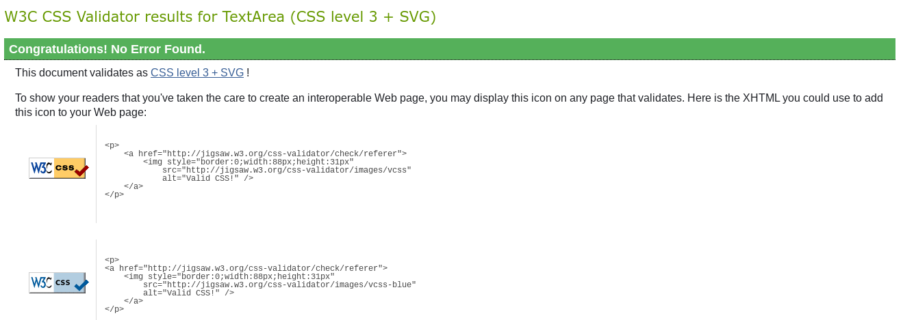

### HTML Validation
All four html files have been validated via the official [HTML Validator](https://validator.w3.org/) and have passed.

- Home.html


- Menu.html
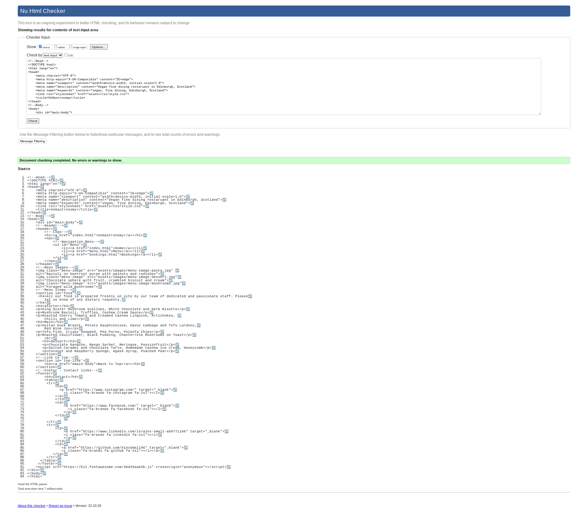

- Bookings.html


- Form-Response.html
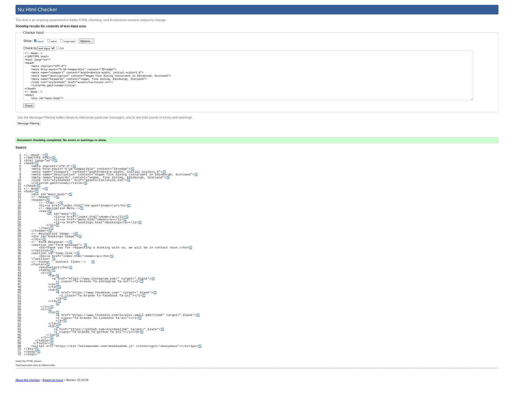

## Compatibility and Responsive Testing
🚨**Required** 

Minimally you should use dev tools and emulators to try to test you site on various screen sizes and browsers and note it in a table:

I ensured my site was worked well, and looked nice on a variety of devices & browsers as noted in the table below:

| TOOL / Device                 | BROWSER     | OS         | SCREEN WIDTH  |
|-------------------------------|-------------|------------|---------------|
| real phone: motog6            | chrome 78   | android 8  | XS 360 x 640  |
| browser stack: iPhone5s       | safari  13  | iOs        | XS 320 x 568  |
| dev tools emulator: pixel 2   | firefox  69 | android 8  | SM 411 x 731  |
| browserstack: iPhone 10x      | Chrome 78   | iOs 11     | SM 375 x 812  |
| browserstack: nexus 7 - vert  | Chrome 78   | android 7  | M 600 x 960   |
| real tablet: ipad mini - vert | safari  13  | iOs 6      | M 768 x 1024  |
| browserstack: nexus 7 - horiz | firefox 69  | android 7  | LG 960 x 600  |
| chrome emulator: ipad - horiz | safari 13   | iOs        | LG 1024 x 768 |
| browserstack windows PC       | Chrome 78   | windows 10 | XL 1920 x 946 |
| real computer: mac book pro   | safari 12.1 | Mohave     | XL 1400 x 766 |
| browserstack windows pc       | IE Edge 88  | windows 10 | XL 1920 x 964 |


🚀 **merit & beyond**
Document why you chose the devices:

1. Visit https://gs.statcounter.com/browser-market-share to figure out the most popular browsers & operating system combos seen across the web for the geographic region, and platform(s) and screen sizes you expect your users to belong to. 

2. Include a sentence about why you chose the combinations you did.

3. Create a table that lists out what devices, browsers, and operating system you tested your application on and a brief description of why you chose the mixture you did. The point is to prove that you looked at the site across various browsers, operating systems, and viewport breakpoints.

4. if you can't find the browser/device/OS combinations you want on Browserstack with your GitHub student webpack (or you didn't activate that in time), note what you'd ideally test on then what you ended up testing on as a compromise. 

5. Build a table to summarize the choices you made [markdown table generator](https://www.tablesgenerator.com/markdown_tables)

The combinations above were chosen because of the following information I gathered  from [ga.statcounter.com]( https://gs.statcounter.com/browser-market-share) for the US from Aug-Oct 2021:
**browser Version Market Share**:
  - safari iphone: 26.32%
  - chrome for android: 21.32%
  - Chrome 105.0: 15.77%
  - Chrome 104.0: 6.28%
  - Edge 105: 4.99%
  - Safari 15.6 3.76%
**browser Market Share**
  - chrome: 50.28%
  - Safari: 34.65%
  - Edge: 6.37%
  - Firefox: 3.52%
  - Samsung Internet: 2.04%
  - Opera: 0.89%
**platform breakdown**
  - mobile: 51.26%
  - desktop: 45.73%
  - tablet: 2.97%
  - console: 0.03%

## Manual Testing
🚨**Required** 

For any scenarios that have not been automated, test the user stories/features manually and provide as much detail as is relevant. A particularly useful form for describing your testing process is via scenarios in markdown such as:

**Manual Testing For Contact Form**
1. Contact form:
    1. Go to the "Contact Us" page
    2. Try to submit the empty form and verify that an error message about the required fields appears
    3. Try to submit the form with an invalid email address and verify that a relevant error message appears
    4. Try to submit the form with all inputs valid and verify that a success message appears.

Or you can use markdown check boxes and write them up per feature:

**Manual Testing For Contact Form**
- [x] try to submit 
- [x] Try to submit the empty form and verify that an error message about the required fields appears
- [x] Try to submit the form with an invalid email address and verify that a relevant error message appears
- [x] Try to submit the form with all inputs valid and verify that a success message appears.
- [x] no console errors
- [x] submit goes to code institute data dump page in new tab
- [x] looks good on mobile (one column)
- [x] looks good on tablet (two columns)
- [x] looks good on desktop (two columns but not SUPER HUGE)

Or you can use a spreadsheet
    
Here is a [Manual Testing Template](https://docs.google.com/spreadsheets/d/1vc1IVL-ydQwWeWMqnk_GRox6HE6qxDLpchGse8Crayo/edit#gid=296578096) that you can use as a starting point to keep track of your testing efforts. Make a copy of it in your own account and update as needed to reflect the browsers you are testing and features.  

It's ok to spot check specific functionality across devices and browsers but each page should be viewed as a whole for each device/browser combo at least once.

A quick way to check if items are exceeding the screen width of a project is to run this javascript in the console for various screen emulations:

```
var docWidth = document.documentElement.offsetWidth;
[].forEach.call(document.querySelectorAll('*'),function(el){if(el.offsetWidth > docWidth){console.log(el);}});
```


## Outstanding Defects
🚨**Required** 

It's ok to not resolve all the defects you found as long as:
- it does not impact a user from completing a vital function on the website
- it only affects a very small subset of users
- is an extreme edge case that very few users would try
- there is an open issue against a framework, browser or technology used

If you know of something that isn't quite right, create an issue and link to it here and explain why you chose not to resolve it. 

Sometimes it's as simple, word wrapping issue that makes the site look odd at a certain screensize that you just didn't have time to fix due to the impending deadline it's best to mention it but note why you allowed it to go live: "Yes it looks odd, but it doesn't impact core functionality of the site." than to let the accessors think you didn't notice it. 

## Core Web Vitals
🚀 **merit & beyond**
SEO is greatly impacted by your core web vitals. The readout from https://web.dev/measure/ which is essentially a lighthouse audit gives your site scores in 4 categories. Ideally you want your site to be in the green for all 4 scores. web.dev has dedicated servers to test deployed sites without extensions that skew the results, so it's best to get results from this site.
 You should talk about the results for each section pay attention to 


## Accessibility Testing
🚨**Required** 

Accessibility testing is aimed to make sure that those with visual or physical disabilities can still browse your website. Some users have had strokes or accidents that make it difficult to use a mouse, so they use keyboard keys to tab through sites. Others use screen readers that rely on HTML tags to help the user navigate quickly through the site to find information they want, others have color blindness or contrast issues. It's the law to provide services 
Here's a [site](https://www.w3.org/WAI/fundamentals/accessibility-intro/#:~:text=Accessibility%20is%20Important%20for%20Individuals%2C%20Businesses%2C%20Society,-The%20Web%20is&text=That%20is%2C%20the%20accessibility%20barriers,older%20people) where you can learn more about accessibility and the internet.

### Accessibility Audits
🚨**Required** 

Accessibility audits run through the HTML and determine if the parts of the WCAG (web content accessibility guidelines ) that are implemented through HTML tags and attributes are present. They can do some checking for low vision/contrast stuff too.

You should run your deployed website pages through  at least on auditing tool. lighthouse's audit to check performance, accessibility, best practices and SEO scores. You should aim to get 85 or higher score on accessibility. 

**You should fix issues associated with:**
- contrast 
- aria labels
- alt text
- large images
- skewed images

**Lighthouse**
https://web.dev/measure/  If you have lower scores, read the report and follow the links to address the flagged issues. You can run this tool from Chrome Dev Tools too against your local machine, but chrome extensions can sometimes give you missing alt text on things like the grammarly plug in tracking pixel.

You want a score in the green for accessibility and should look at ways to get it to 100.


**[WAVE chrome](https://chrome.google.com/webstore/detail/wave-evaluation-tool/jbbplnpkjmmeebjpijfedlgcdilocofh?hl=en-US) extension**
Wave is developed by webaim.org and does a bit better at contrast issues and uses 2.1 guidelines

**Contrast Checkers**
- https://webaim.org/resources/contrastchecker/
- https://color.a11y.com/

### Keyboard Navigation
🚀 **merit & beyond**

Another way to accessibility test your site is to try to click on the browser URL and see what happens if you use the tab, arrow and enter keys. Does it work well or does the user get stuck? Check this in a couple browsers as the focus & active outlines are typically styled by the browser

The expected results for various keyboard entries and field types can be found [here](https://webaim.org/techniques/keyboard/#testing)

You can take a video of this testing if you want and convert it to a gif and paste that into your readme. Record something to yourself in a Slack direct message, then download it. Then you can use https://cloudconvert.com/mp4-to-gif to convert the mp4 to a gif and just paste it into the readme via GiHu, and it'll resolve itself.


### Chrome Vox Reader
🚀 **merit & beyond**

If you are really ambitious, you can use the [VoxReader](https://chrome.google.com/webstore/detail/screen-reader/kgejglhpjiefppelpmljglcjbhoiplfn?hl=en) extension in chrome to see what your site sounds like on a screen reader. It really drives home the need for good aria-labels & semantic HTML.

# Technologies and Languages Used
🚀 **merit & beyond**

- Lanuages used were HTML and CSS
- Gitpod was used to write the code and preview the site

## Frameworks, Libraries & Programs Used
🚀 **merit & beyond**

- fontawesome
- gitpod
- github
- google fonts


- Coolors.co
- amiresponsive
- table of contents creator
- markdown table generator

# Deployment
🚨**Required** 

This section should describe the process you went through to deploy the project to a hosting platform (e.g. GitHub Pages).

-Enumerate steps and use screenshots to make the instructions are clear.

You may want to re-watch the [initial deployment in gitpod video](https://learn.codeinstitute.net/courses/course-v1:CodeInstitute+LR101+2021_T1/courseware/4a07c57382724cfda5834497317f24d5/9b06129195c64fada6783de9cfe82d60/) when writing up this section.

## Deploy to GitHub Pages
🚨**Required** 

Write out steps you would take and test them to deploy your code to GitHub Pages, include screenshots if you think they would make the process easier.

## Forking The Repository
🚀 **merit & beyond**

A fork creates a completely independent copy of Git repository. In contrast to a fork, a Git clone creates a linked copy that will continue to synchronize with the target repository, so if you want to ensure other people don't commit to your public repo, you might want to tell them to fork the repository :) 

## Run Locally With GitPod
🚀 **merit & beyond**

Enumerate and write the steps of how to run a project locally via gitPod. Include Screenshots to maximize the impact of the instructions.

# Credits
🚨**Required** 

To avoid plagiarism amd copyright infringement, you should mention any other projects, stackoverflow, videos, blogs, etc. that you used to gather imagery or ideas for your code even if you used it as a starting point and modified things. Giving credit to other people's efforts and ideas that saved you time acknowledges the hard work others did.  The accessors expect something here, there is no way you didn't have to get help on making such a nice project.

## Content
🚨**Required** 

Use bullet points to list out sites you copied text from and cross-reference where those show up on your site. If you truly are an expert in the content you provided, say that due to your exposure/experience of the topic covered, you created the content on your own.

## Media
🚨**Required** 

Make a list of sites you used images, icons & youtube, & audio files from. If you used several sites try to match up each image to the correct site. This includes attribution for icons if they came from font awesome or other sites, give them credit. If you took the images yourself, give yourself credit.

You should not be using images taken from copyrighted sites, but only royalty free ones. Try typing `!copyright` in slack and see what help it gives you for this topic.

## Acknowledgments
🚀 **merit & beyond**

This is the section where you refer to code examples, mentors, blogs, stack overflow answers and videos that helped you accomplish your end project. Even if it's an idea that you updated you should note the site and why it was important to your completed project.

If you used a CodeInstitute Example project as a starting point. Make note of that here.
